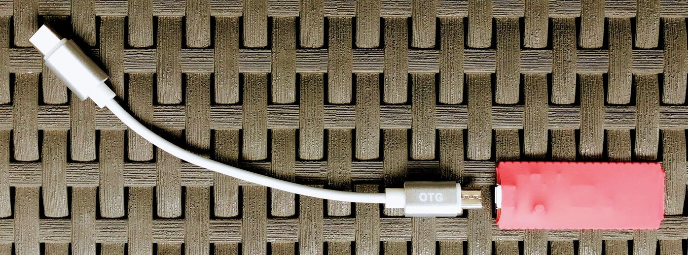

#  AryKey Firmware
<br />

[link-android]: https://github.com/ryanamaral/arykey-android 'Version published on Github'
[link-chrome]: https://github.com/ryanamaral/arykey-chrome-extension 'Version published on Github'
[link-firmware]: https://github.com/ryanamaral/arykey-firmware 'Version published on Github'

[][link-android] <b>Android App</b> [][link-android]

[][link-chrome]  <b>Chrome Extension</b> [][link-chrome]

[][link-firmware] <b>Firmware</b> [][link-firmware]

<br />

## 👀 Overview

The firmware takes one input and generates a deterministic password using a key derivation function (KDF).

Same input, same output. The expected **input** is a **512 bits** hash in hex format.

The inputs are received via USB serial port connection.

By pressing the physical button, the password is typed automatically using an emulated keyboard. **Once the password is typed, it's gone from memory.**

The **password** output lenght is **88 characters**.

The **seed** is stored in the flash memory.


## 🔧 Create `seed.cpp` file

1. Open `seed.cpp.example`
2. Edit the `seed` variable with a random generated hex string (min. 512 chars)

	```
	#include <pgmspace.h>
	
	const char *seed PROGMEM =
	  "4dff...";
	```
3. Save it with the filename `seed.cpp`
4. Done!


## 🏗️ Hardware



1. **Raspberry Pi Pico**
2. **OTG Cable**: Micro-USB (male) to USB-C (male)
3. **Cover/Case**


## 💡 LED States

* `ON`
	* Default
* `PULSING`
	* Password ready to type
* `BLINKING`
	* Typing... (fast blink)
* `OFF`
	* No power input
	* Or something went wrong


## 📚 Libraries

* [Raspberry Pi Pico Arduino core](https://github.com/earlephilhower/arduino-pico)
	* Port of the RP2040 (Raspberry Pi Pico processor) to the Arduino ecosystem. 
	* It uses the bare Raspberry Pi Pico SDK and a custom GCC 10.3/Newlib 4.0 toolchain.
* [Base64](https://sourceforge.net/p/libb64/)
* [Keyboard](https://github.com/arduino-libraries/Keyboard)
* KDF


## 📄 License

//TODO
